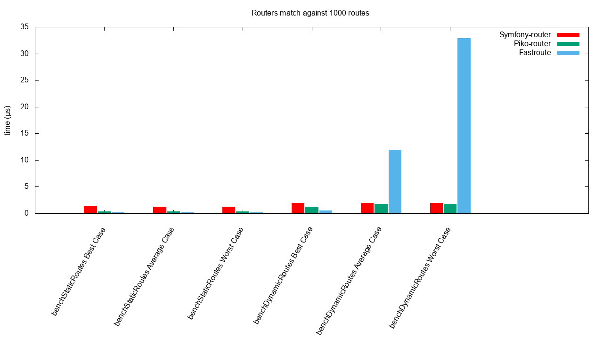
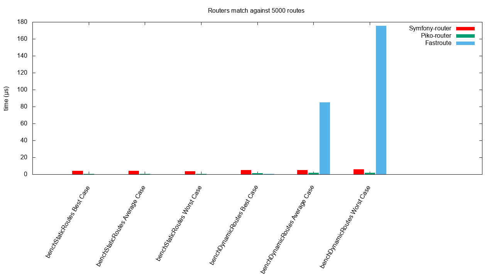

# Piko Router

[](https://github.com/piko-framework/router/actions/workflows/php.yml)
[](https://coveralls.io/github/piko-framework/router?branch=main)

A lightweight and blazing fast router (see [benchmarks](#benchmarks)) using a [radix trie](https://en.wikipedia.org/wiki/Radix_tree) to store dynamic routes.

This router maps routes to user defined handlers and can do the reverse operation (reverse routing).

## Installation

It's recommended that you use Composer to install Piko Router.

```bash
composer require piko/router
```

## Usage

A basic example:

```php
use piko\Router;

$router = new Router();
$router->addRoute('/', 'homeView');
$router->addRoute('/user/:id', 'userView');

$match = $router->resolve('/');
echo $match->handler // homeView

$match = $router->resolve('/user/10');
echo $match->handler // userView
echo $match->params['id'] // 10

// Use of the $match->handler to dispatch an action
// ...

// Reverse routing
echo $router->getUrl('homeView'); // /
echo $router->getUrl('userView', ['id' => 3]); // /user/3
```

Dynamic handlers:

```php
use piko\Router;

$router = new Router();
$router->addRoute('/admin/:module/:action', ':module/admin/:action');

$match = $router->resolve('/admin/user/add'); 
echo $match->handler; // user/admin/add

echo $router->getUrl('blog/admin/index'); // /admin/blog/index

```

Advanced usage: [See RouterTest.php](tests/RouterTest.php)

## Benchmarks

Piko router comparison against Fastroute (cached) and Symfony router (cached).

### Benchmark against 1000 generated routes

```bash
./vendor/bin/phpbench run --revs=10000 --report='extends:aggregate,break:["benchmark"]'
```

```
SymfonyRouter
+--------------------+--------------+-------+-----+----------+---------+--------+
| subject            | set          | revs  | its | mem_peak | mode    | rstdev |
+--------------------+--------------+-------+-----+----------+---------+--------+
| benchStaticRoutes  | Best Case    | 10000 | 5   | 7.241mb  | 1.243μs | ±2.00% |
| benchStaticRoutes  | Average Case | 10000 | 5   | 7.241mb  | 1.296μs | ±2.40% |
| benchStaticRoutes  | Worst Case   | 10000 | 5   | 7.241mb  | 1.267μs | ±2.35% |
| benchDynamicRoutes | Best Case    | 10000 | 5   | 7.241mb  | 2.007μs | ±1.64% |
| benchDynamicRoutes | Average Case | 10000 | 5   | 7.241mb  | 1.984μs | ±1.87% |
| benchDynamicRoutes | Worst Case   | 10000 | 5   | 7.241mb  | 1.929μs | ±1.69% |
+--------------------+--------------+-------+-----+----------+---------+--------+

PikoRouter
+--------------------+--------------+-------+-----+----------+---------+--------+
| subject            | set          | revs  | its | mem_peak | mode    | rstdev |
+--------------------+--------------+-------+-----+----------+---------+--------+
| benchStaticRoutes  | Best Case    | 10000 | 5   | 1.862mb  | 0.327μs | ±1.78% |
| benchStaticRoutes  | Average Case | 10000 | 5   | 1.862mb  | 0.330μs | ±2.37% |
| benchStaticRoutes  | Worst Case   | 10000 | 5   | 1.862mb  | 0.318μs | ±1.61% |
| benchDynamicRoutes | Best Case    | 10000 | 5   | 1.862mb  | 1.308μs | ±1.51% |
| benchDynamicRoutes | Average Case | 10000 | 5   | 1.862mb  | 1.800μs | ±0.72% |
| benchDynamicRoutes | Worst Case   | 10000 | 5   | 1.862mb  | 1.735μs | ±2.64% |
+--------------------+--------------+-------+-----+----------+---------+--------+

FastRoute
+--------------------+--------------+-------+-----+----------+----------+--------+
| subject            | set          | revs  | its | mem_peak | mode     | rstdev |
+--------------------+--------------+-------+-----+----------+----------+--------+
| benchStaticRoutes  | Best Case    | 10000 | 5   | 3.155mb  | 0.228μs  | ±2.46% |
| benchStaticRoutes  | Average Case | 10000 | 5   | 3.155mb  | 0.213μs  | ±1.19% |
| benchStaticRoutes  | Worst Case   | 10000 | 5   | 3.155mb  | 0.235μs  | ±1.60% |
| benchDynamicRoutes | Best Case    | 10000 | 5   | 3.155mb  | 0.652μs  | ±1.36% |
| benchDynamicRoutes | Average Case | 10000 | 5   | 3.155mb  | 12.908μs | ±1.13% |
| benchDynamicRoutes | Worst Case   | 10000 | 5   | 3.155mb  | 31.784μs | ±1.53% |
+--------------------+--------------+-------+-----+----------+----------+--------+
```



### Benchmark against 5000 generated routes

```bash
ROUTES=5000 ./vendor/bin/phpbench run --revs=10000 --report='extends:aggregate,break:["benchmark"]'
```

```
SymfonyRouter
+--------------------+--------------+-------+-----+----------+---------+--------+
| subject            | set          | revs  | its | mem_peak | mode    | rstdev |
+--------------------+--------------+-------+-----+----------+---------+--------+
| benchStaticRoutes  | Best Case    | 10000 | 5   | 31.488mb | 3.911μs | ±2.47% |
| benchStaticRoutes  | Average Case | 10000 | 5   | 31.488mb | 3.709μs | ±1.78% |
| benchStaticRoutes  | Worst Case   | 10000 | 5   | 31.488mb | 3.771μs | ±1.40% |
| benchDynamicRoutes | Best Case    | 10000 | 5   | 31.488mb | 4.775μs | ±1.74% |
| benchDynamicRoutes | Average Case | 10000 | 5   | 31.488mb | 4.844μs | ±0.46% |
| benchDynamicRoutes | Worst Case   | 10000 | 5   | 31.488mb | 5.657μs | ±2.16% |
+--------------------+--------------+-------+-----+----------+---------+--------+

PikoRouter
+--------------------+--------------+-------+-----+----------+---------+--------+
| subject            | set          | revs  | its | mem_peak | mode    | rstdev |
+--------------------+--------------+-------+-----+----------+---------+--------+
| benchStaticRoutes  | Best Case    | 10000 | 5   | 4.569mb  | 0.312μs | ±1.82% |
| benchStaticRoutes  | Average Case | 10000 | 5   | 4.569mb  | 0.313μs | ±1.01% |
| benchStaticRoutes  | Worst Case   | 10000 | 5   | 4.569mb  | 0.313μs | ±0.40% |
| benchDynamicRoutes | Best Case    | 10000 | 5   | 4.569mb  | 1.242μs | ±1.92% |
| benchDynamicRoutes | Average Case | 10000 | 5   | 4.569mb  | 1.897μs | ±1.36% |
| benchDynamicRoutes | Worst Case   | 10000 | 5   | 4.569mb  | 1.947μs | ±2.04% |
+--------------------+--------------+-------+-----+----------+---------+--------+

FastRoute
+--------------------+--------------+-------+-----+----------+-----------+--------+
| subject            | set          | revs  | its | mem_peak | mode      | rstdev |
+--------------------+--------------+-------+-----+----------+-----------+--------+
| benchStaticRoutes  | Best Case    | 10000 | 5   | 11.248mb | 0.208μs   | ±1.44% |
| benchStaticRoutes  | Average Case | 10000 | 5   | 11.248mb | 0.211μs   | ±1.33% |
| benchStaticRoutes  | Worst Case   | 10000 | 5   | 11.248mb | 0.225μs   | ±1.51% |
| benchDynamicRoutes | Best Case    | 10000 | 5   | 11.248mb | 0.584μs   | ±1.96% |
| benchDynamicRoutes | Average Case | 10000 | 5   | 11.248mb | 85.164μs  | ±1.09% |
| benchDynamicRoutes | Worst Case   | 10000 | 5   | 11.248mb | 171.611μs | ±0.84% |
+--------------------+--------------+-------+-----+----------+-----------+--------+
```


